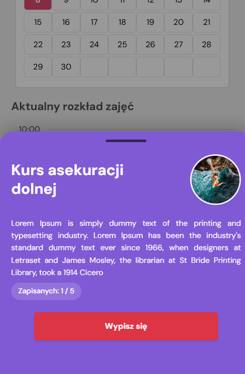
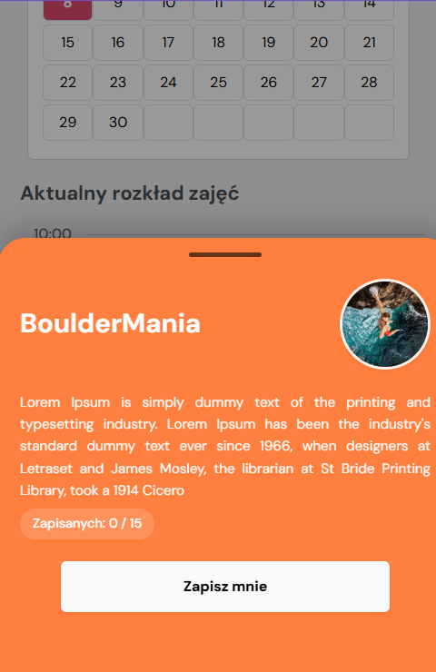
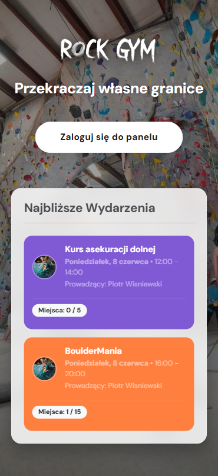
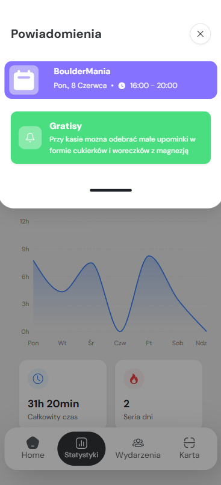
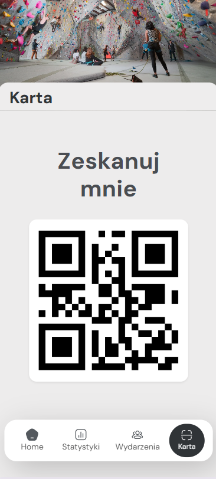

# Gym Rock - aplikacja webowa dla klientów ścianki wspinaczkowej

**Gym Rock** to aplikacja webowa przeznaczona dla klientów ścianki wspinaczkowej. Jej głównym zadaniem jest możliwość śledzenia wykupionych usług i produktów, historii zakupów, organizacja wydarzeń grupowych oraz zarządzanie wejściami za pomocą wirtualnych kart QR. Aplikacja jest skierowana zarówno do użytkowników obiektu, jak i instruktorów.

### Jaki problem rozwiązuje Gym Rock?
Gym Rock automatyzuje operacje. Eliminuje konieczność posiadania fizycznych, plastikowych kart poprzez wbudowany system wejść oparty na kodach QR. Dzięki aplikacji, klienci mogą samodzielnie kupować wejścia na wydarzenia online, przeglądać historię swoich wejść(statystyki, kluczowe dla zapalonych wspinaczy) oraz otrzymywać powiadomienia na żywo. Co może znacząco skrócić kolejki i odciążyć pracowników recepcji.

### Czym wyróżnia się Gym Rock?
System stawia na bezpośrednią wygodę użytkownika i minimalizm. Gym Rock oferuje intuicyjny, responsywny interfejs oparty na technologii React. Integruje wszystko w jednym miejscu: powiadomienia na żywo, wirtualne karty, statystyki i proste płatności. Dostarczając szybkie i stabilne rozwiązania dla nowoczesnego klubu.

# Uruchomienie projektu

## Użyte technologie

| Kategoria | Technologia | Wersja |
|-----------|-------------|--------|
| **Frontend** | [React](https://react.dev/) | 19.2.4 |
| | [Vite](https://vitejs.dev/) | 8.0.0 |
| | [React Bootstrap](https://react-bootstrap.github.io/) | 2.10.10 |
| **Backend** | [PHP](https://www.php.net/) | ^8.5 |
| | [Laravel](https://laravel.com/) | 13.0 |
| **Baza Danych** | [SQLite](https://www.sqlite.org/index.html) | - |

### Wymagania programowe

Do uruchomienia projektu wymagane są:
- **Node.js** (zalecana wersja 20+) oraz menedżer pakietów **npm**.
- **PHP** (wersja 8.5 lub nowsza).
- **Git** (do pobrania repozytorium).

## Proces instalacji i konfiguracji

Projekt składa się z dwóch głównych części: backendu (`gym-rock-api`) i frontendu (`gym-rock`). Należy skonfigurować obie aplikacje.

1. **Pobranie projektu:**
   ```bash
   git clone https://github.com/BartlomiejKufel/projekt-gym-rock.git
   cd projekt-gym-rock
   ```

2. **Konfiguracja backendu (API):**
   ```bash
   cd gym-rock-api
   composer install
   cp .env.example .env
   php artisan key:generate
   ```
   *Baza danych domyślnie wykorzystuje SQLite.*
   
   Uruchom migracje, aby zbudować strukturę bazy i załadować dane:
   ```bash
   php artisan migrate --seed
   ```

3. **Konfiguracja frontendu (Aplikacja klienta):**
   ```bash
   cd ../gym-rock
   npm install
   ```

## Uruchomienie projektu

Aplikacja wymaga równoległego uruchomienia dwóch serwerów (frontend i backend). Najlepiej otworzyć dwa osobne okna terminala.

**Uruchomienie serwera backend (z katalogu `gym-rock-api`):**
```bash
php artisan serve
```
*API będzie dostępne pod adresem: `http://localhost:8000`*

**Uruchomienie serwera frontend (z katalogu `gym-rock`):**
```bash
npm run dev
```
*Aplikacja frontendowa będzie dostępna w przeglądarce pod adresem wyświetlonym w terminalu (np. `http://localhost:5173`).*

**Gdy będziemy już na stronie**
Mamy możliwość zalogowania się jako czwórka różnych użytkowników:

| Imie i nazwisko | Login | Hasło |
|-----------|-------------|--------|
| Jan Kowalski | admin | admin |
| Piotr Wiśniewski | instruktor | instruktor |
| Marta Wójcik | klient | klient |
| Anna Nowak | pracownik | pracownik |

Trzeba zauważyć że w przypadku instruktora jest on jedynym użytkownikiem który ma możliwość dodawania i usuwania wydarzeń. Ponieważ ma on w systemie role instruktora (role_id = 3).

### Użytkownicy mogą:
- logować się do aplikacji
- przeglądać swoje zakupione karnety, te aktywne oraz te które już minęły
- zapisywać się na wydarzenia
- zmieniać swoje dane
- sprawdzać statystyki swoich wejść

### Instruktorzy mogą:
- to co użytkownicy
- dodawać i usuwać swoje wydarzenia
- sprawdzać listę zapisów na swoje wydarzenia

# Podręcznik użytkownika

## Dostęp dla użytkownika niezalogowanego
Aplikacja jest dostępna dla użytkowników niezalogowanych w zakresie przeglądania informacji na temat najbliższych wydarzeń oraz możliwości logowania. 

### Strona główna 
Po wejściu w pierwszy ścieżkę aplikacji `/` ukazuje nam się lista najbliższych wydarzeń nagłówek z napisem zapraszającym potencjalnych klientów na przyjście na ściankę oraz przycisk który przeniesie użytkownika do strony logowania. Po naciśnięciu w jakieś z wyświetlonych wydarzeń użytkownik również zostanie przekierowany na stronę logowania.


### Strona logowania
Na stronie logowania znajduje się formularz logowania z polami login, hasło oraz checkboxem "Zapamiętaj mnie". Formularz podlega walidacji, a wszelakie błędy pojawiają się nad całym formularzem np.: "Nie znaleziono użytkownika", "Błędne hasło" lub "Pole login jest wymagane". Jeśli formularz zostanie uzupełniony prawidłowo użytkownik zostanie przekierowany na stronę panelu głównego. Na stronie znajduje się również przycisk powrotu na stronę główną.


## Dostęp dla użytkownika zalogowanego
Użytkownik zalogowany ma dostęp do wszystkich funkcji aplikacji, poza funkcjami dostępnymi dla instruktora. Cztery główne widoki to: *Panel główny, Statystyki, Wydarzenia, Karta* można się między nimi przełączać za pomocą dolnego paska nawigacji. Na wszystkich widokach jest też możliwość odpalenia nakładki powiadomień. Wystarczy nacisnąć w przycisk dzwoneczka w lewym górnym rogu.


### Panel główny
Po zalogowaniu użytkownik zostaje przekierowany na stronę panelu głównego `/home`. Na stronie tej znajdują się wszystkie karnety albo oferty które użytkownik ma wykupione. Oferty są wyświetlane w formie kart na których są informacje na temat co to za oferta, daty zakupu, daty wykorzystania, ile dni zostało jeszcze do wykorzystania. Dni zmieniają kolory w zależności od tego ile ich jeszcze zostało.


### Statystyki 
Na stronę statystyk można dostać się korzystając z dolnego paska nawigacji. Wyświetlane są tu statystyki dotyczące liczby wejść na obiekt pod rząd oraz ilość czasu spędzona na nim. Można też sprawdzić poszczególne dni oraz tygodnie za pomocą wykresu. Można wybierać z listy rozwijanej czy chcemy widzieć statystyki z danego tygodnia czy miesiąca.


### Wydarzenia
W tym miejscu użytkownik może przeglądać wydarzenia oraz zapisać się na wydarzenia której jeszcze się nie zaczęły. Użytkownik ma dostęp do interaktywnego kalendarza, może zmieniać miesiące oraz wybierać konkretne dni.


Jeśli w danym dniu znajdują się jakieś wydarzenia wyświetlą się one pod spodem kalendarza. W postaci kart na których znajduje się nazwa wydarzenia, informacja o tym kto je prowadzi i w jakich wydarzeniach się ono odbędzie. Pod listą wydarzeń użytkownik może znaleść wydarzenia na które jest już zapisany. Oczywiści tylko te które jeszcze się nie zaczęły.


Kiedy użytkownik chciałby dostać więcej informacji o danym wydarzeniu wystarczy że w nie naciśnie pojawi się wtedy karta z bardziej szczegółowymi informacjami na temat wydarzenia (opis, liczba osób zapisanych). Na karcie szczegółów znajdziemy również przycisk `Zapisz mnie` / `Wypisz mnie` w zależności od tego czy dany użytkownik jest już zapisany na to wydarzenie. Kliknięcie w ten przycisk spowoduje wypisanie użytkownika z wydarzenia lub przeniesienie na stronę płatności.

<p align="center">
  
  
</p>

### Płatność za wydarzenia
Po naciśnięciu przycisku `Zapisz mnie` na wybranym wcześniej wydarzeniu, użytkownik zostanie przeniesiony na stronę płatności. Na stronie znajdziemy kartę z podsumowaniem wydarzenia (data, cena, prowadzący) oraz formularz który będzie wypełniony danymi z bazy na temat użytkownika (imie, nazwisko, email) i Dane karty płatniczej potrzebne do zaksięgowania wpłaty. Dla testu użytkownik może wpisać dane które powinny przejść zawsze: `4242 4242 4242 4242 12/30 123 38200`. Pod formularzem znajdują się również zgody, wszystkie obowiązkowe do zaznaczenia żeby zapisać się na wydarzenie. 


Jeśli wszystkie dane są wpisane poprawnie użytkownik może nacisnąć przycisk `Potwierdź zapis i zapłać`. Po udanej transakcji użytkownik zostanie przeniesiony na stronę ze stosownym komunikatem.


### Karta
Na stronę Karty użytkownik może wejść jedynie za pośrednictwem głównego paska wyboru. Znajduje się tutaj kod qr który użytkownik może zeskanować przy wejść na ściankę. Kod skaluje się z wielkością urządzenia. Jeśli ktoś nie ma wygenerowanego własnego kodu qr wyświetli się stosowny komunikat. 


### Powiadomienia 
Nakładkę można włączyć przez naciśnięcie ikonki dzwoneczka w lewym górnym rogu każdego widoku. Znajdują się tutaj wszystkie najnowsze powiadomienia dodawane przez administratorów i pracowników ścianki. Użytkownik może tutaj również znaleźć informacje na temat wydarzeń na które jest zapisany. Aby wyłączyć nakładkę użytkownik musi nacisnąć przycisk z X lub nacisnąć na zaciemnioną część aplikacji.


### Profil
Aby wejść w swój profil użytkownik musi nacisnąć w ikonkę ludzika w prawym górnym rogu aplikacji może tego dokonać na 4 głównych widokach (Panelu głównym, Statystykach, Wydarzeniach, Karcie). Na środku strony profilowej znajduje się lista kilku przycisków funkcyjnych z czego *Oświadczenie osoby pełnoletniej, Jednorazowa Zgoda i Oświadczenie rodzica/opiekuna, Regulamin* przenoszą do pdfów gotowych do wydrukowania/przegląnięcia. Historia zakupów przenosi użytkownika do własnego widoku tak samo jak Kontakt i Zmiana danych. Przycisk Wyloguj służy do wylogowania użytkownika z aplikacji. Aby wrócić do Panelu głównego należy nacisnąć ikonkę pięciokonta w prawym górnym rogu. 


### Historia zakupów
Na tym widoku użytkownik może swobodnie sprawdzać swoje wydatki z ostatniego czasu w przejrzystej formie. Każdy zakup to oddzielny rekord w tabeli z opisem, datą zakupu oraz ceną. Aby wyjść z tego widoku należy nacisnąć ikonkę ludzika w prawym górnym rogu.


### Zmiana danych
Strona zmiany danych opiera się głównie na formularzu w którym użytkownik może bez żadnego problemu zmieniać swoje dane, na przykład takie jak: hasło, email czy zdjęcie profilowe. Aby zapisać zmiany muszą być wypełnione wszystkie pola oprócz hasła. Formularz obsługuje walidację jeśli wystąpi jakiś problem albo dane zostaną źle wprowadzone przez użytkownika aplkacja poinformuje o tym zainteresowanego. Aby wyjść z tego widoku należy wykonać ten sam krok co przy widoku Histori zakupów.


### Kontakt
Na tej stronie użytkownik może znaleźć wszystkie możliwe źródła kontaktu z recepcją oraz adres i godziny otwarcia ścianki.


## Dostęp dla instruktora
Instruktor ma dostęp do funkcji których standardowy użytkownik nie ma, na przykład dodawania wydarzeń. Oczywiście instruktor ma również dostęp do wszystkich funkcji standardowego użytkownika.

### Dodawanie wydarzeń
Na tej stronie instruktor może dodawać nowe wydarzenie. Widok strony składa się z formularza w którym instruktor musi wpisać takie informacje jak limit osób na wydarzeniu, opis, tytuł. Ma też możliwość wybrania kategorii wydarzenia, koloru jaki później wyświetli się w liście wydarzeń oraz godziny i daty rozpoczęcia i zakończenia wydarzenia. Po wypełnieniu formularza wystarczy nacisnąć `Dodaj wydarzenie`, wtedy zostaną sprawdzone wszystkie wprowadzone dane i jeśli nie wystąpi błąd instruktor zostanie znowu przeniesiony na stronę wydarzeń. W przeciwnym wypadku wyświetli się komunikat informujący o błędzie.


### Szczegóły wydarzeń
Instruktor widzi więcej szczegółów wydarzenia od zwykłych użytkowników. Ma tu dostęp również do listy użytkowników którzy już zapisali się na dane wydarzenie. Wystarczy że naciśnie przycisk `Pokaż szczegóły` widoczny w karcie wydarzenia. 


Jeśli na dane wydarzenie nie ma jeszcze zapisanego żadnego użytkownika instruktor będzie mógł usunąć takie wydarzenie. Przez naciśnięcie przycisku `Usuń wydarzenie` w szczegółach wydarzenia.


## Widoki responsywne
Aplikacja jest przygotowana również pod urządzenia mobilne oraz inne ekrany. Poniżej przedstawiono widok panelu głównego, powiadomień oraz karty z kodem qr na urządzeniu mobilnym.
<p align="center">
  
  
  
</p>


# Plany rozbudowy

- W orginalnej wersji projektu zabrakło dodania możliwości zakupów karnetów przez użytkowiników. Standardowo klienci muszą kupować karnety na miejscu, co zwiększa kolejki i czas obsługi. Docelowo planowane jest dodanie możliwości zakupu karnetów online.
- Wspinacze lubią sprawdzać i porównywać swoje statystyki, dobrą opcją byłoby dodanie ligi dla wspinaczy, gdzie mogliby rywalizować między sobą. Dodatkowo można by dodać możliwość oceniania dróg przez wspinaczy, co pozwoliłoby na stworzenie rankingu trudności dróg. 